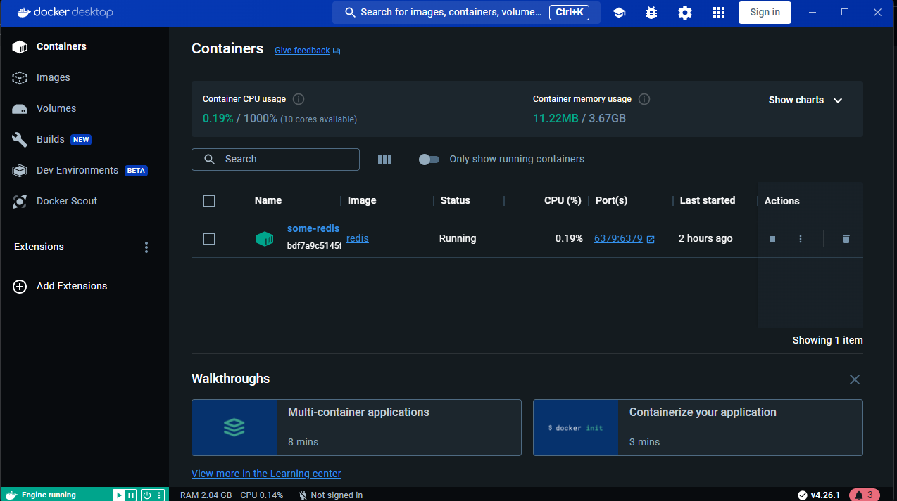
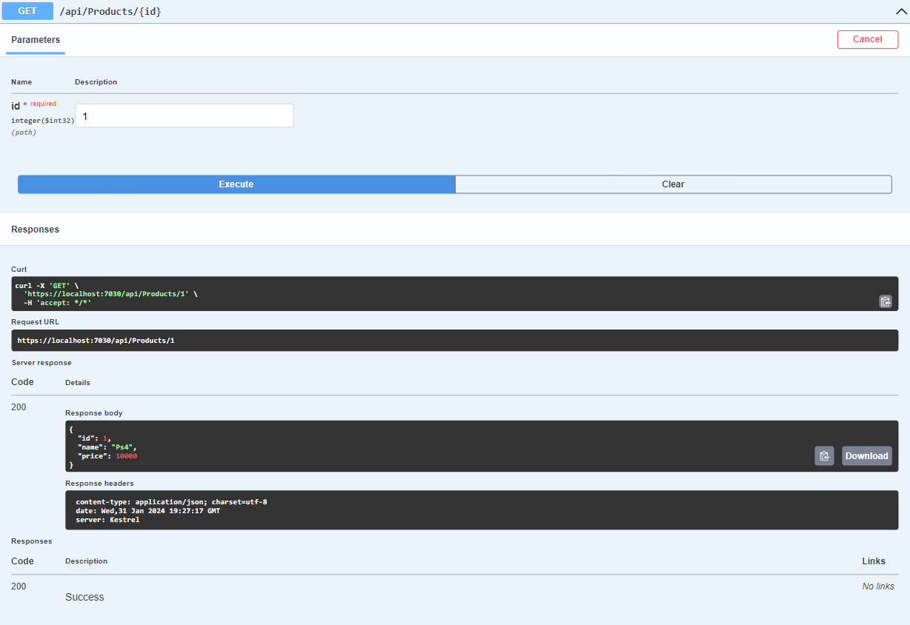
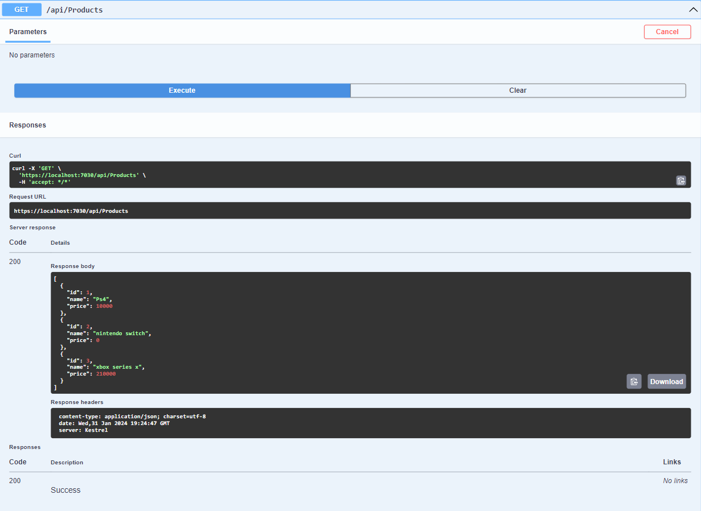
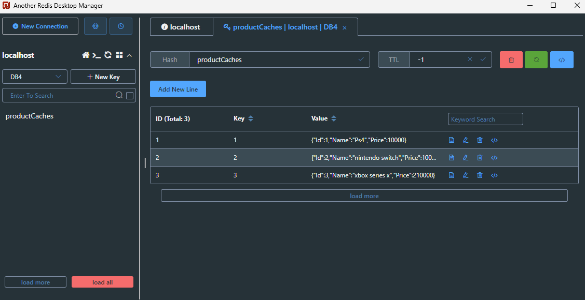
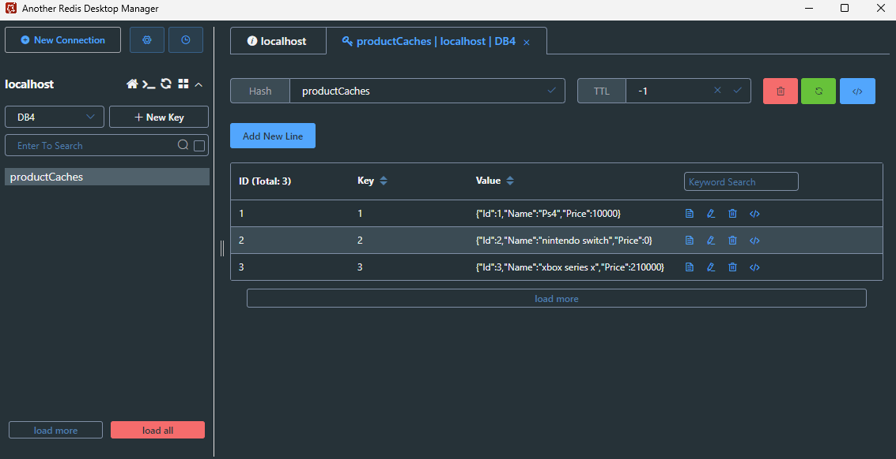

# Content of the Project

### In The Project,
> The types, life and usage areas of caching have been processed.

>Topics such as IMemoryCache interface and methods, cache priority and registerPostEvictionCallback method are covered.

>Topics such as the use of Redis Desktop Manager, Redis data types and features have been discussed.

>Asp.Net Topics such as how to use distributed caching in Core projects, IDistributedCache interface and methods, caching of complex types and files have been covered.

>StackExchange.The use of the Redis API, methods related to Redis data types, transaction and batch operations are focused on topics such as.
---

>Connecting and standing up Redis with Docker Container.

----

----

